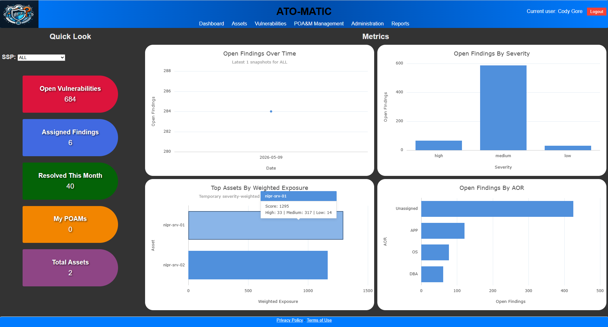
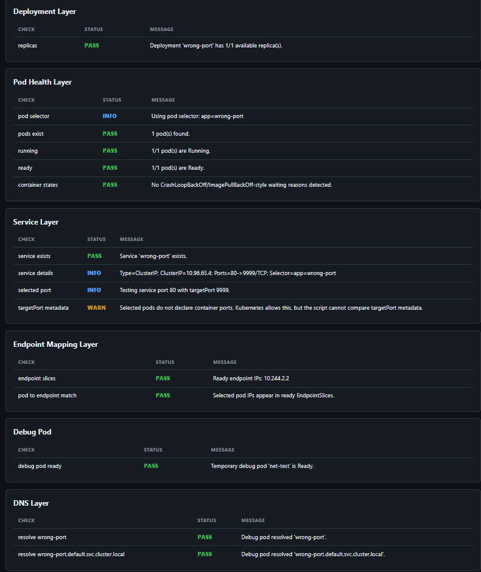
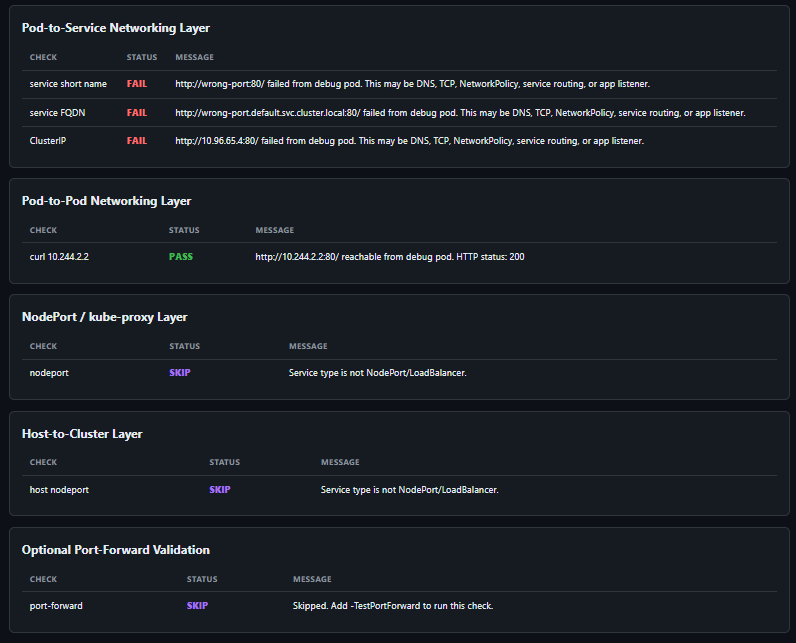

# Work-Display

A collection of practical tools, scripts, and small projects I have built while working in IT, system administration, DevOps, security compliance, and automation.

This repo is part portfolio, part toolbox. Some items are polished enough to use directly, while others are preserved as examples of real operational workflows and problem solving.

## Featured Projects

| Project | What It Does | Start Here |
|---|---|---|
| **ATO-Matic v1** | Docker-based local STIG vulnerability and POA&M tracker with seeded PostgreSQL data. | [projects/ato-matic-v1](./projects/ato-matic-v1) |
| **KubeNetChecker** | PowerShell Kubernetes network troubleshooting tool with layered diagnosis and JSON/Markdown/HTML reports. | [powershell/kubernetes/KubeNetChecker](./powershell/kubernetes/KubeNetChecker) |
| **Preload External MFA** | Microsoft Graph / Entra ID automation for preloading external authentication methods during migration work. | [powershell/azure](./powershell/azure) |

## Screenshots

Screenshots are intentionally collapsed so the main page stays readable.

<details>
<summary>ATO-Matic screenshots</summary>

The dashboard is the best quick visual summary of the app: findings, severity, assets, AORs, and exposure at a glance.



Additional screenshots are included in the [ATO-Matic project README](./projects/ato-matic-v1).

</details>

</details>

<details>
<summary>KubeNetChecker screenshots</summary>

KubeNetChecker can export a dark HTML report for sharing troubleshooting results.


Additional report screenshots:





</details>

## Repository Map

```text
projects/
  ato-matic-v1/             Docker Compose deployment bundle for ATO-Matic

powershell/
  active-directory/         AD helper module
  app-pkg/                  Legacy/internal app packaging module
  azure/                    Entra ID / Microsoft Graph automation
  docker/                   Docker helper functions
  hyper-v/                  Hyper-V utilities
  kubernetes/               Kubernetes troubleshooting tools
  stig-etl/                 STIG definition prep/import utilities for ATO-Matic

discord-bots/               Small Discord bot experiments
assets/screenshots/         Optional screenshots for repo documentation
```

## Other Tools

<details>
<summary>PowerShell: Active Directory</summary>

[powershell/active-directory](./powershell/active-directory)

Contains a small AD helper module. The main function, `Copy-AdGroups`, copies or adds group memberships from one user to another.

</details>

<details>
<summary>PowerShell: Docker Helpers</summary>

[powershell/docker/Docker-Helper](./powershell/docker/Docker-Helper)

Small quality-of-life helpers for Docker and Docker Compose in PowerShell.

</details>

<details>
<summary>PowerShell: Hyper-V</summary>

[powershell/hyper-v](./powershell/hyper-v)

Includes `Get-VMInfo`, a small utility for listing VM name, memory, CPU, and disk details.

</details>

<details>
<summary>PowerShell: STIG ETL</summary>

[powershell/stig-etl](./powershell/stig-etl)

Support scripts used to extract, normalize, and import STIG definition data for ATO-Matic. This is kept partly as an ETL example and partly as project history.

</details>

<details>
<summary>PowerShell: App-Pkg</summary>

[powershell/app-pkg](./powershell/app-pkg)

Legacy/internal app packaging automation from an on-prem development environment. Paths are sanitized and supporting pipeline pieces are not included.

</details>

<details>
<summary>Discord Bots</summary>

[discord-bots](./discord-bots)

Small bot experiments and JavaScript automation examples.

</details>

## Notes

- Some scripts contain sanitized paths or placeholders from old work environments.
- Review scripts before running them in your own environment.
- The ATO-Matic Docker bundle includes a seeded database dump so the Compose deployment can initialize a working local instance.

## Requests / Ideas

If you have a repetitive task, a workflow that needs cleanup, or something that should be automated, feel free to reach out or open an issue.
