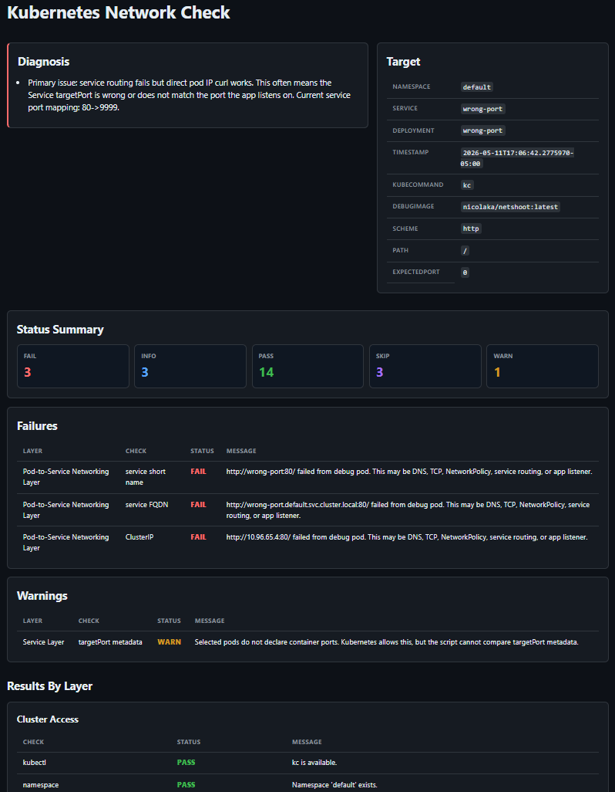
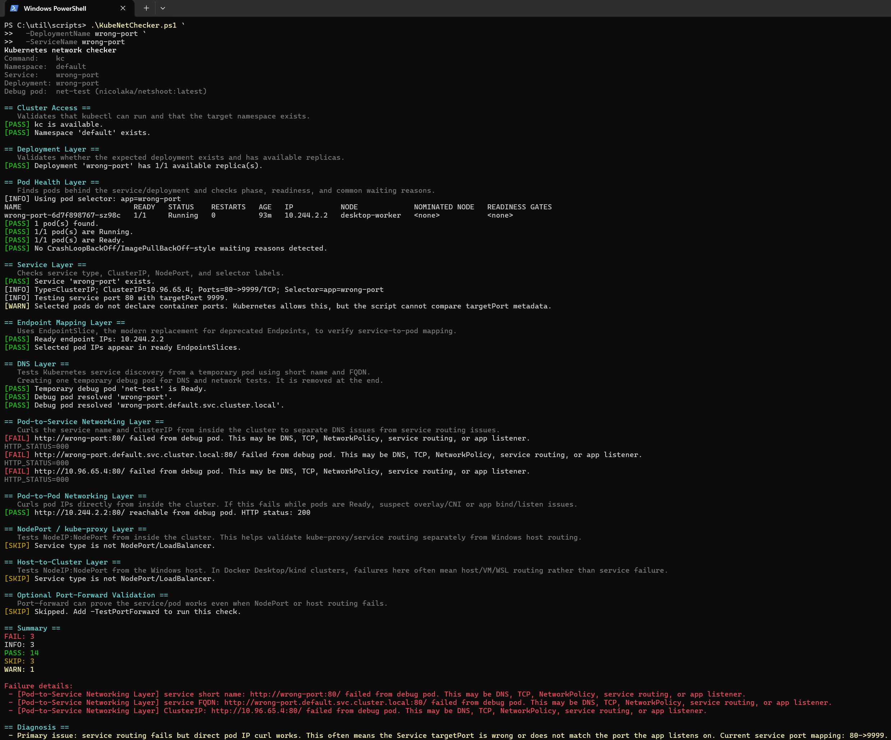

# KubeNetChecker

`KubeNetChecker.ps1` is a PowerShell Kubernetes service-network troubleshooting helper.

It walks a service path layer by layer and tries to identify the likely failure domain instead of only reporting a generic curl failure.

## What It Checks

- Kubernetes API and namespace access
- deployment availability
- pod phase, readiness, and common container failure states
- pod-specific DNS settings: `dnsPolicy`, `dnsConfig`, and `hostNetwork`
- service type, selector, port, and `targetPort`
- EndpointSlice population
- DNS resolution from inside the cluster
- pod-to-service connectivity
- pod-to-pod connectivity
- NodePort reachability from inside the cluster
- host-to-NodePort reachability
- optional `kubectl port-forward`
- optional exec-based DNS checks inside a selected workload pod

## Screenshots

<details>
<summary>HTML report preview</summary>




</details>

<details>
<summary>Terminal output</summary>



</details>

## Sample Reports

Sample exports from a deliberately broken `wrong-port` service are included:

- [HTML report](./sample-exports/wrong-port.html)
- [JSON report](./sample-exports/wrong-port.json)

GitHub displays HTML files as source. To view the rendered HTML report, download/open it locally in a browser.

## Requirements

Local machine:

- PowerShell 5.1+ or PowerShell 7+
- `kubectl` in `PATH`
- valid kubeconfig/current context

Cluster permissions:

- read namespaces, deployments, pods, services, EndpointSlices, and nodes
- create/delete a temporary debug pod for DNS/curl checks
- exec into the temporary debug pod
- optional exec into a selected workload pod when `-TestPodDns` is used

The script uses `kubectl` by default. Use `-KubeCommand` if you prefer a wrapper such as `kc`, `kubecolor`, `oc`, or a full executable path.

## Quick Start

```powershell
.\KubeNetChecker.ps1
```

Defaults:

```powershell
-Namespace default
-ServiceName nginx
-UrlScheme http
-Path /
```

Check a specific service:

```powershell
.\KubeNetChecker.ps1 -ServiceName my-service -Namespace apps
```

Check a service and deployment:

```powershell
.\KubeNetChecker.ps1 `
  -DeploymentName my-api `
  -ServiceName my-api `
  -Namespace apps
```

Check a specific service port/path:

```powershell
.\KubeNetChecker.ps1 `
  -ServiceName my-api `
  -Namespace apps `
  -ServicePort 8080 `
  -Path /health
```

## Parameters

### Target

| Parameter | Default | Description |
|---|---:|---|
| `-Namespace` | `default` | Namespace to test. |
| `-DeploymentName` | empty | Deployment to check. If omitted, the script tries the service name. |
| `-ServiceName` | `nginx` | Service to troubleshoot. |
| `-ServicePort` | `0` | Service port clients should hit. If omitted, the first service port is used. |
| `-UrlScheme` | `http` | URL scheme for curl tests, usually `http` or `https`. |
| `-Path` | `/` | HTTP path to test. |
| `-PodSelector` | empty | Optional pod label selector. |

### Debug Pod

| Parameter | Default | Description |
|---|---:|---|
| `-DebugImage` | `nicolaka/netshoot:latest` | Debug pod image. Can be an internal registry image. |
| `-DebugPodName` | `net-test` | Temporary debug pod name. |
| `-SkipDebugPod` | false | Skip checks that require a temporary pod. |

### Optional Tests

| Parameter | Default | Description |
|---|---:|---|
| `-TimeoutSec` | `5` | Timeout for curl/local HTTP checks. |
| `-KubeCommand` | `kubectl` | Override command name/path, such as `kc`, `kubecolor`, `oc`, or a full path. |
| `-SkipNodePort` | false | Skip NodePort and host-to-NodePort tests. |
| `-TestPortForward` | false | Run optional port-forward validation. |
| `-TestPodDns` | false | Exec into a selected workload pod to read `/etc/resolv.conf` and run available DNS tools against the service FQDN and short service name. |
| `-DnsPodName` | empty | Optional workload pod name for `-TestPodDns`. If omitted, the script picks a ready selected pod. |
| `-DnsContainer` | empty | Optional container name for `-TestPodDns` exec checks. |

### Output

| Parameter | Default | Description |
|---|---:|---|
| `-ExportJson` | empty | Write a JSON report. |
| `-ExportHtml` | empty | Write a dark themed HTML report. |
| `-Verbose` | false | Show underlying kubectl commands. |

## Common Examples

Use an internal debug image:

```powershell
.\KubeNetChecker.ps1 `
  -ServiceName my-service `
  -Namespace prod `
  -DebugImage registry.company.local/tools/netshoot:v0.13.0
```

Run a safer read-mostly pass:

```powershell
.\KubeNetChecker.ps1 `
  -ServiceName my-service `
  -Namespace prod `
  -SkipDebugPod `
  -SkipNodePort
```

Test HTTPS:

```powershell
.\KubeNetChecker.ps1 `
  -ServiceName secure-api `
  -Namespace apps `
  -UrlScheme https `
  -ServicePort 443 `
  -Path /health
```

Use a specific pod selector:

```powershell
.\KubeNetChecker.ps1 `
  -ServiceName api-service `
  -Namespace apps `
  -PodSelector "app=api,tier=backend"
```

Run port-forward validation:

```powershell
.\KubeNetChecker.ps1 `
  -ServiceName api `
  -Namespace apps `
  -TestPortForward
```

Run pod-specific DNS exec checks:

```powershell
.\KubeNetChecker.ps1 `
  -ServiceName api `
  -Namespace apps `
  -TestPodDns
```

Run pod-specific DNS exec checks against a named pod/container:

```powershell
.\KubeNetChecker.ps1 `
  -ServiceName api `
  -Namespace apps `
  -TestPodDns `
  -DnsPodName api-7f8d9c4d5b-x2p6q `
  -DnsContainer api
```

Export reports:

```powershell
.\KubeNetChecker.ps1 `
  -ServiceName api `
  -Namespace apps `
  -ExportJson .\api-net-check.json `
  -ExportHtml .\api-net-check.html
```

Run from Linux/macOS with PowerShell:

```bash
pwsh ./KubeNetChecker.ps1 -ServiceName nginx -Namespace default
```

## Diagnosis Examples

Image pull or crash issues:

```text
Primary issue: image pull failure detected...
Primary issue: container is crashing (CrashLoopBackOff)...
```

Selector mismatch:

```text
Primary issue: service selector mismatch.
The deployment appears healthy, but the service selector does not match any pods.
```

Wrong service `targetPort`:

```text
Primary issue: service routing fails but direct pod IP curl works.
Current service port mapping: 80->9999.
```

Host exposure issue:

```text
Internal service routing is healthy, but the Windows host cannot reach NodePort.
```

## Reading The Output

The most useful part is the final `Diagnosis` section. The earlier sections are supporting evidence.

General flow:

```text
cluster access
  -> deployment/pods
  -> service/EndpointSlice
  -> DNS
  -> service curl
  -> pod IP curl
  -> NodePort/host access
```

If an early layer fails, later network checks may be skipped to avoid noisy false leads.

## Notes

- The debug pod is temporary and is removed at the end.
- Some production clusters may block debug pods, `exec`, public image pulls, node reads, or port-forwarding.
- Pod-specific DNS metadata inspection is read-only. Exec checks inside workload pods run only when `-TestPodDns` is supplied.
- If the selected workload container does not include `nslookup` or `getent`, those individual checks are skipped.
- Container ports are metadata. A `targetPort` metadata mismatch is a warning unless curl behavior also confirms it.
- NetworkPolicy, Ingress, MTU, route-table, and CNI-specific checks are not currently deep-scanned.

## Exit Codes

- `0` when no failures were found.
- `1` when failures were found or a hard blocker occurred.

Warnings and skipped checks do not automatically cause failure.
