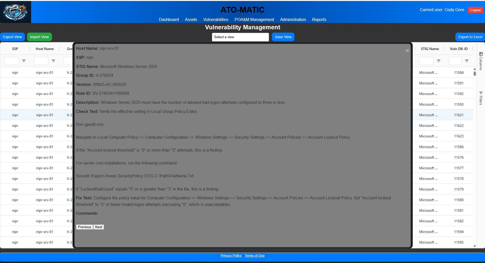
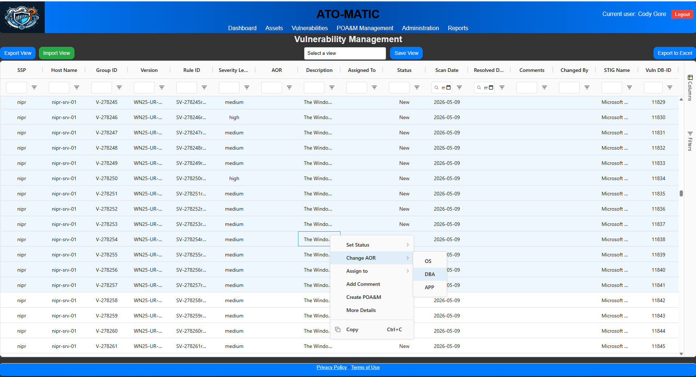
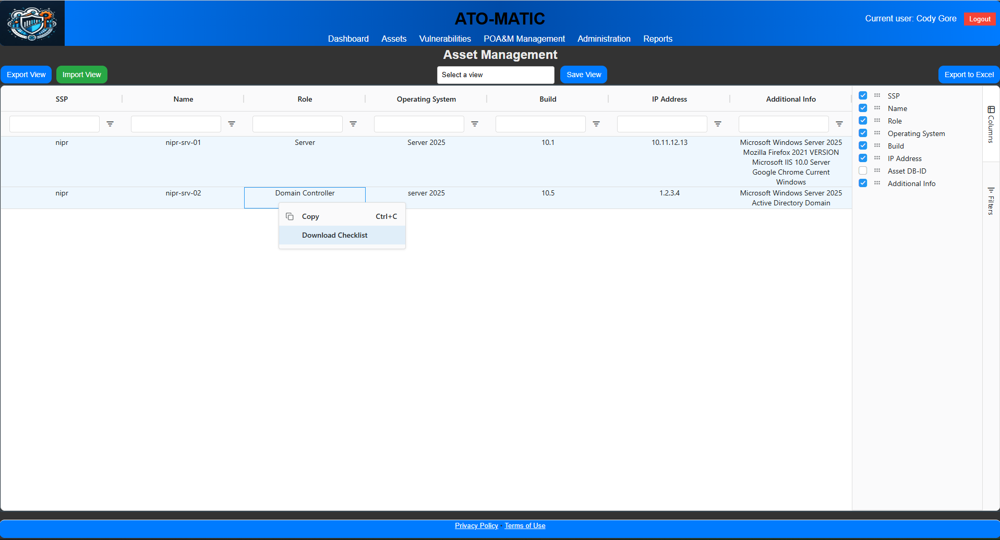
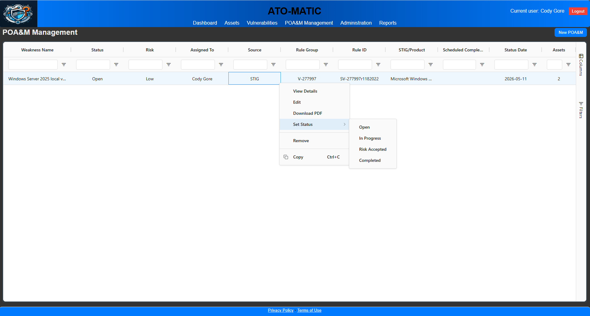
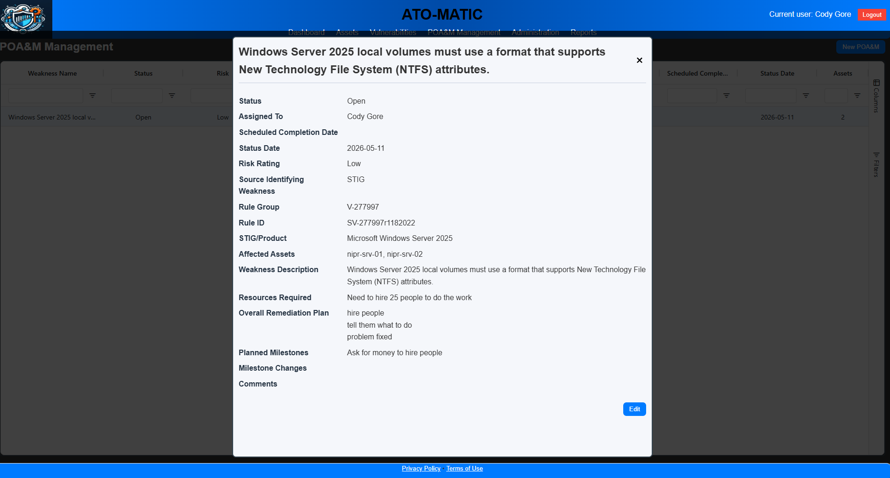
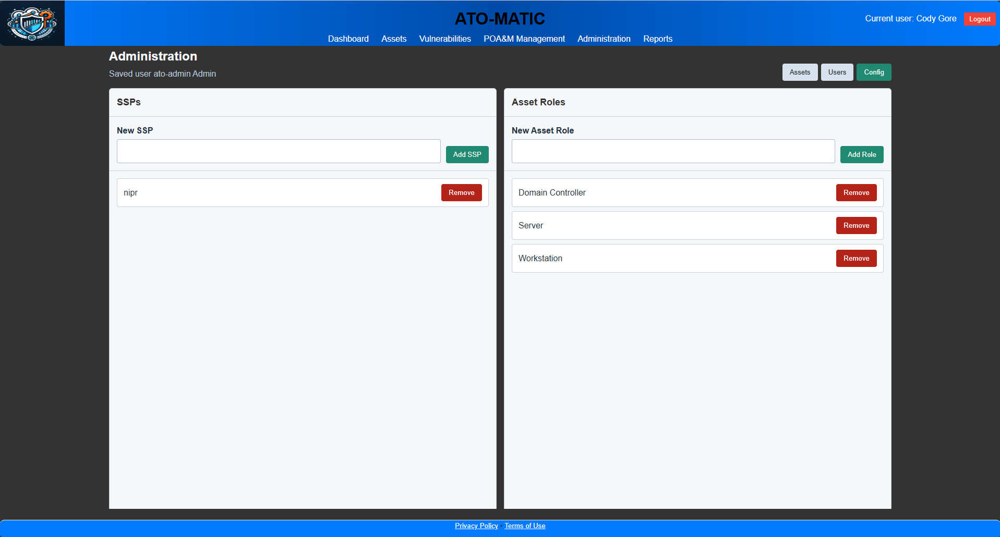
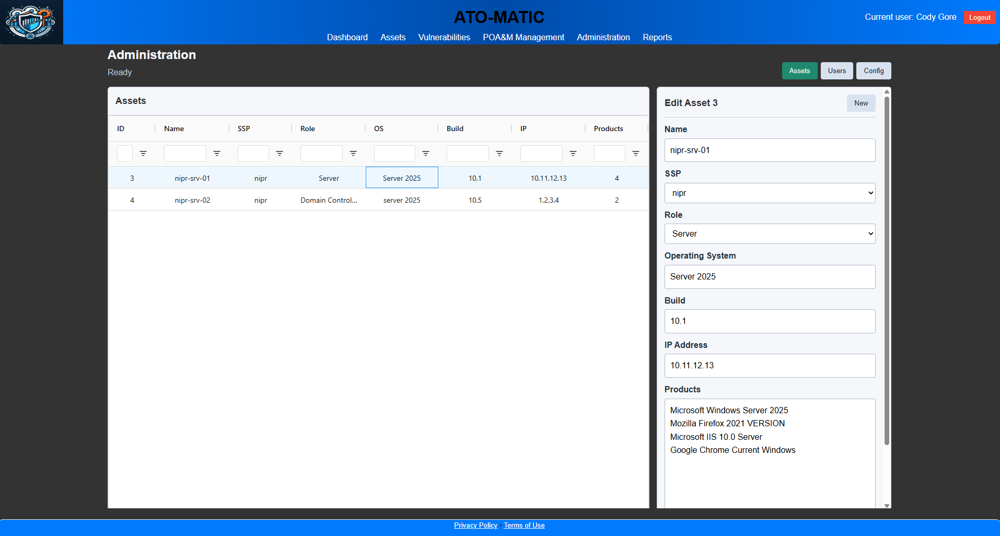
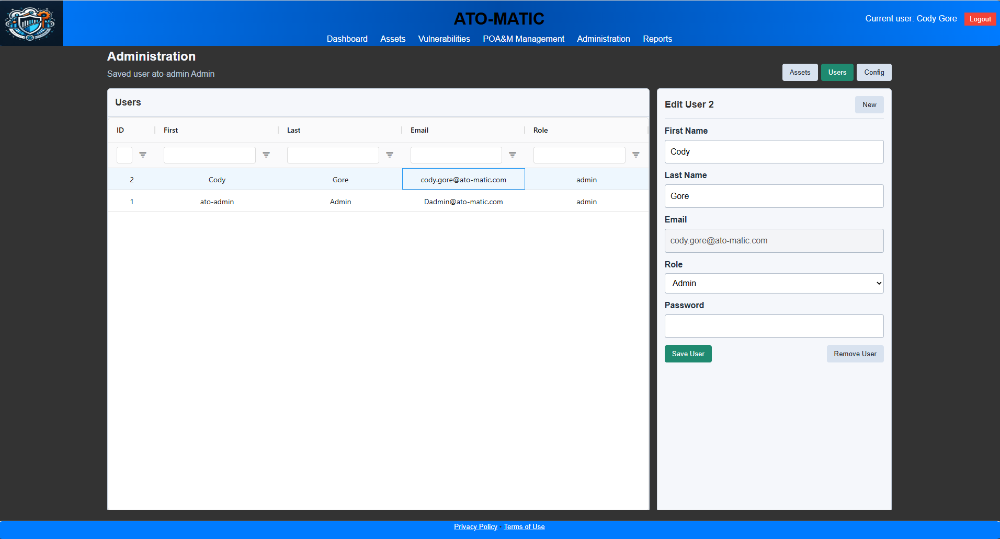

# ATO-Matic v1

Docker-based deployment bundle for ATO-Matic, a local web app for working with STIG-based vulnerability data, assets, and POA&M tracking.

This bundle is meant to let someone spin up a local instance with Docker Compose.

## Screenshots

<details>
<summary>Dashboard</summary>


</details>

<details>
<summary>Vulnerability Management</summary>





</details>

<details>
<summary>Assets</summary>



</details>

<details>
<summary>POA&M Management</summary>





</details>

<details>
<summary>Administration</summary>







</details>

## Includes

- `docker-compose.yml` for the app and PostgreSQL database
- `.env.example` for local configuration
- seeded PostgreSQL init dump at `init/dump.sql`
- unique STIG product reference list
- default admin account for first login

## Start

1. Copy `.env.example` to `.env`.
2. Edit `.env` and set real values for `DB_PASSWORD` and `SESSION_SECRET`.
3. Set `ATO_MATIC_IMAGE` if you need a different published image tag.
4. Run:

```powershell
docker compose up -d
```

Open:

```text
http://localhost:8000
```

Default login:

- Username: `ato-admin`
- Email: `Dadmin@ato-matic.com`
- Password: `TemPWD2026!!`

The database is initialized from `init/dump.sql` the first time the Postgres volume is created.

## Important

- Change the default admin password after first login.
- Update `.env` secrets before using this beyond local testing.
- If you need to reinitialize the database, remove the Compose volume and start again.
